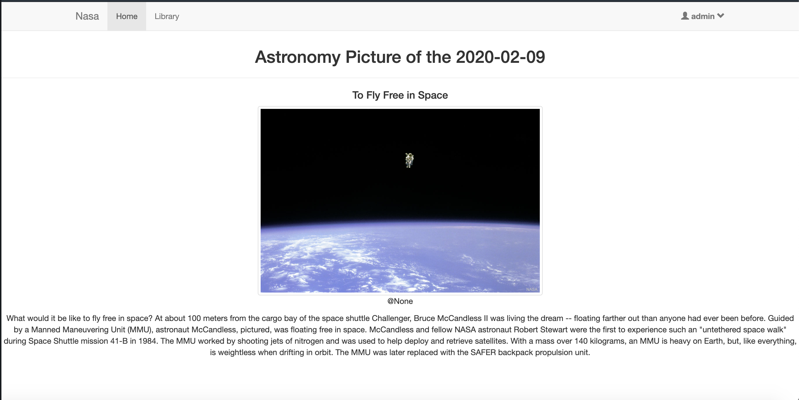
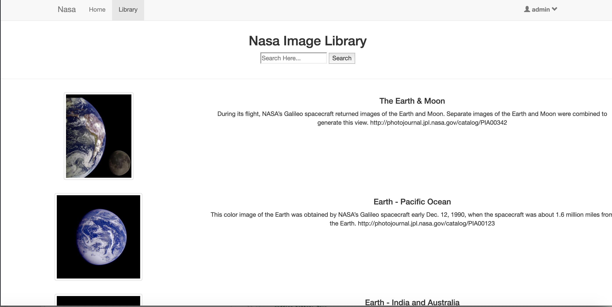

# nasa-api
Nasa api sample project with django

## Installation

- Create a virtual environment (python3 -m venv ./env)
- Install pip files with requirements.txt(pip install -r requirements.txt)

## Screenshots

1. APOD: Astronomy Picture of the Day

    
    
2. Nasa Image Library

    
